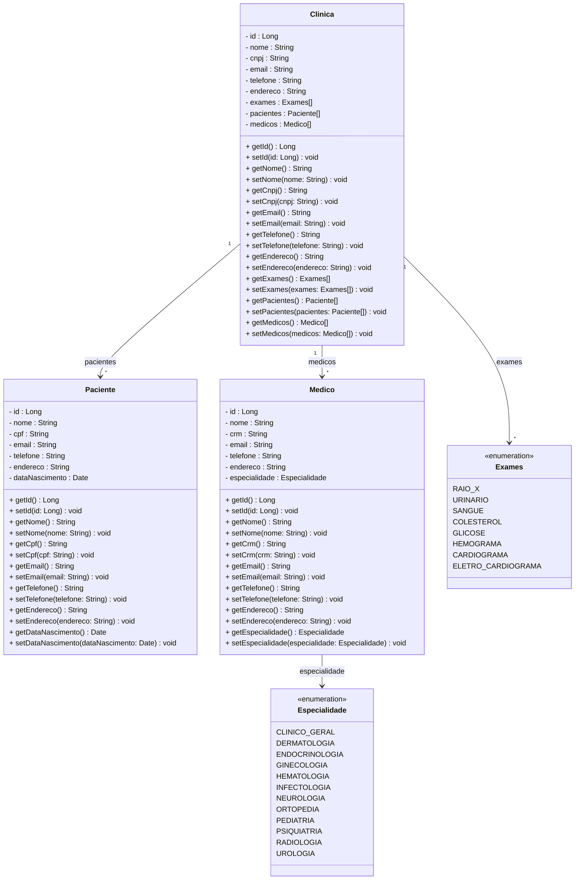

# Fábrica de Software 2025/2
Lucas Bigas Padilha

## Propostas de projeto
- Nome do sistema: Sistema Clinico 
  - Funcionalidade 1 Cadastrar dados do Paciente
  - Funcionalidade 2 Cadastrar Medicos 
  - Funcionalidade 3 Cadastrar Especialidades
  - Funcionalidade 4 Cadastrar Exames
  - Funcionalidade 5 Cadastrar clinicas 
  

## Aula 05/08

- JRE - Java Runtime Enviroment
  - Ambiente mínimo para executar um programa Java
  - JVM - Java Virtual Machine (java.exe ou javaw.exe)

- JDK - Java Development Kit
  - [Adoptium JDK](https://adoptium.net/pt-BR)
  - Ambiente de DESENVOLVIMENTO (javac.exe) compilador

- COMPILAÇÃO
  1) Escreve um programa em java (arquivo.java)
  2) Compilação arquivo.java -> javac.exe -> bytecode arquivo.class
- EXECUÇÃO
  3) Passar .class -> java.exe (JVM) -> ling máquina

- VSCode
  - [VSCode](https://code.visualstudio.com/)
  - [Java Extension Pack](https://marketplace.visualstudio.com/items?itemName=vscjava.vscode-java-pack)
    
## Histórias de Usuário
- Como um funcionário, eu gostaria de cadastrar um paciente, para que ele possa ser atendido na clínica.
- Como um funcionário, eu gostaria de editar os dados de um paciente, para corrigir informações incorretas.
- Como um funcionário, eu gostaria de excluir um paciente, caso seja necessário remover registros duplicados ou incorretos.
- Como um funcionário, eu gostaria de visualizar a lista de pacientes cadastrados, para facilitar a consulta.
- Como um funcionário, eu gostaria de cadastrar um médico, para que ele possa atender pacientes na clínica.
- Como um funcionário, eu gostaria de editar os dados de um médico, para atualizar informações como especialidade ou contato.
- Como um funcionário, eu gostaria de excluir um médico, caso ele não trabalhe mais na clínica.
- Como um funcionário, eu gostaria de consultar a lista de médicos, para verificar quem está disponível.
- Como um funcionário, eu gostaria de cadastrar uma especialidade médica, para associar aos médicos.  
- Como um funcionário, eu gostaria de editar uma especialidade, para corrigir informações ou nomes.  
- Como um funcionário, eu gostaria de excluir uma especialidade, caso não seja mais utilizada.
- Como um funcionário, eu gostaria de cadastrar um exame, para que ele possa ser agendado e realizado.  
- Como um funcionário, eu gostaria de editar um exame, para atualizar informações de procedimento ou preço.  
- Como um funcionário, eu gostaria de excluir um exame, caso não seja mais oferecido.  
- Como um funcionário, eu gostaria de cadastrar uma clínica, para poder associar atendimentos e exames.  
- Como um funcionário, eu gostaria de editar os dados de uma clínica, para manter informações atualizadas.  
- Como um funcionário, eu gostaria de excluir uma clínica, caso ela não esteja mais disponível.
## Diagrama de Classes 

